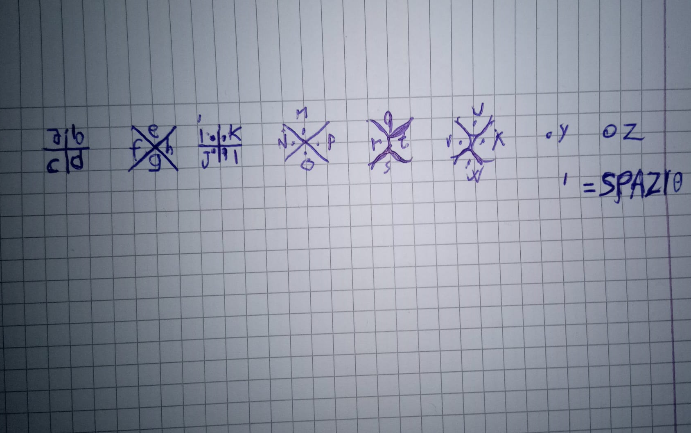

# CheatPapers-language

We all went to exams completley unprepared, right? 

#### *well, this is the language my GF invented to pass cheat papers*

## my process

This basically translates every into a dictionary and then print the encrypted text, ready to be sent/copied
__obviously you still have to learn how to decrypt it__
